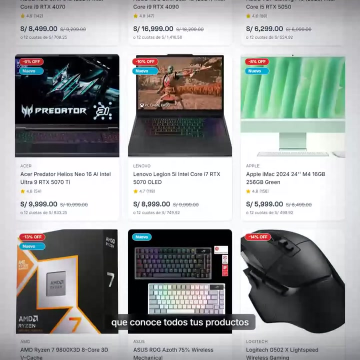

# Example: Causal AI Digital marketing video

A fully-rendered example using the pipeline. This is the actual marketing video we built for our own brand, rendered through **all 6 templates** + several style packs so you can compare them side by side.

## Preview


| Money shot (frame at 12.5s — `/productos` tour) |
|:-:|
|  |

Want the full 30 seconds? → [`output/marketing-square.mp4`](output/marketing-square.mp4) · [`output/marketing-vertical.mp4`](output/marketing-vertical.mp4)

## Templates rendered in this demo

Each row is one structural template; each column is one aspect ratio. Same voiceover + music + logo + URLs across all of them — only the **structure** changes.

| Template | Square (1080×1080) | Vertical (1080×1920) |
|---|---|---|
| `tour-pages` (default) | [`marketing-square.mp4`](output/marketing-square.mp4) | [`marketing-vertical.mp4`](output/marketing-vertical.mp4) |
| `multi-product` | [`marketing-square-multi-product.mp4`](output/marketing-square-multi-product.mp4) | [`marketing-vertical-multi-product.mp4`](output/marketing-vertical-multi-product.mp4) |
| `single-page-tour` | [`marketing-square-single-page-tour.mp4`](output/marketing-square-single-page-tour.mp4) | [`marketing-vertical-single-page-tour.mp4`](output/marketing-vertical-single-page-tour.mp4) |
| `feature-spotlight` | [`marketing-square-feature-spotlight.mp4`](output/marketing-square-feature-spotlight.mp4) | [`marketing-vertical-feature-spotlight.mp4`](output/marketing-vertical-feature-spotlight.mp4) |
| `split-mobile-desktop` | [`marketing-square-split-mobile-desktop.mp4`](output/marketing-square-split-mobile-desktop.mp4) | [`marketing-vertical-split-mobile-desktop.mp4`](output/marketing-vertical-split-mobile-desktop.mp4) |
| `before-after` | [`marketing-square-before-after.mp4`](output/marketing-square-before-after.mp4) | [`marketing-vertical-before-after.mp4`](output/marketing-vertical-before-after.mp4) |

Additionally, the **`bold`**, **`editorial`** and **`tech`** style packs were rendered on `tour-pages`:
- [`marketing-square-bold.mp4`](output/marketing-square-bold.mp4) · [`marketing-vertical-bold.mp4`](output/marketing-vertical-bold.mp4)
- [`marketing-square-editorial.mp4`](output/marketing-square-editorial.mp4) · [`marketing-vertical-editorial.mp4`](output/marketing-vertical-editorial.mp4)
- [`marketing-square-tech.mp4`](output/marketing-square-tech.mp4) · [`marketing-vertical-tech.mp4`](output/marketing-vertical-tech.mp4)

> Note on `split-mobile-desktop` and `before-after`: the URLs available (NovaTech home + `/productos`) aren't ideal for these templates. `split-mobile-desktop` shows the same URL on both devices (no real mobile/desktop divergence). `before-after` uses `/productos` as "antes" and `/` as "ahora" — not a real rebrand. They demonstrate the **structure** but for production you'd point them at proper assets.

## What's in this folder

```
causal-ai-digital-demo/
├── README.md                              ← this file
├── voiceover.mp3                          ← Mateo Aragon (Spanish LATAM), ~24s
├── music.mp3                              ← cinematic ambient
├── causal-ai-digital-logo.png             ← brand logo, transparent PNG
├── transcript.json                        ← word-level whisper.cpp output (52 words)
│
├── tour-pages-{square,vertical}.html      ← default template (placeholders filled with NovaTech URLs)
├── multi-product-{square,vertical}.html   ← 5-slide journey: home → catalogue → 2 products → CTA
├── single-page-tour-{square,vertical}.html ← 23s scroll-tour of one URL + CTA
├── feature-spotlight-{square,vertical}.html ← 3 zoom-and-hold spotlights + CTA
├── split-mobile-desktop-{square,vertical}.html ← 2 device frames side-by-side + CTA
├── before-after-{square,vertical}.html    ← ANTES / AHORA split + CTA
│
├── video-marketing-services.html          ← LEGACY: original tour-pages square (kept for reference)
├── video-marketing-services-vertical.html ← LEGACY: original tour-pages vertical
│
└── output/
    ├── marketing-square.mp4                ← tour-pages, cinematic
    ├── marketing-vertical.mp4
    ├── marketing-square-multi-product.mp4
    ├── marketing-vertical-multi-product.mp4
    ├── marketing-square-{bold,editorial,tech}.mp4   ← style pack variants
    ├── marketing-vertical-{bold,editorial,tech}.mp4
    └── ... (one mp4 per template × style combination rendered)
```

## Inputs we used

| Input | Value |
|---|---|
| **Website URL** | `https://website-pi-seven-28.vercel.app/` (NovaTech Hardware demo store) |
| **Subpage** | `/productos` (multi-page tour) |
| **Logo** | `causal-ai-digital-logo.png` |
| **Contact** | `+51 972 571 826` |
| **Voice** | ElevenLabs Mateo Aragon, Style 30, Speed 0.9, Stability 50 |
| **Music** | YouTube Audio Library, "cinematic inspirational" filter |

## The script (Spanish)

```
Hay webs que se ven.
Hay webs que se sienten.
Y hay webs que venden por ti.

Aprenden de cada visita.
De cada clic.

Cada web que diseñamos viene con un chatbot
que conoce todos tus productos
y atiende a tu cliente
siempre.

Diseño que enamora.
Inteligencia que vende.

Causal AI Digital.
```

50 words, ~24 seconds when read at speed 0.9.

## How they were rendered

Each row in the table above maps to one `record_video.py` invocation:

```bash
cd examples/causal-ai-digital-demo

# Default (tour-pages, cinematic, default channel)
python ../../scripts/record_video.py .

# Other templates — output filenames are auto-suffixed
python ../../scripts/record_video.py . --template multi-product
python ../../scripts/record_video.py . --template single-page-tour
python ../../scripts/record_video.py . --template feature-spotlight
python ../../scripts/record_video.py . --template split-mobile-desktop
python ../../scripts/record_video.py . --template before-after

# Style pack variants on tour-pages
python ../../scripts/record_video.py . --style bold
python ../../scripts/record_video.py . --style editorial
python ../../scripts/record_video.py . --style tech
```

Total render time: ~80 seconds per template (both formats together). All 6 templates + 3 style packs ≈ 12 minutes of render time.

## Reproducing it

If you cloned this repo and have the prerequisites (Python + Playwright + FFmpeg + whisper.cpp — see [main README](../../README.md)), you can re-render any of these:

```bash
# From the repo root
cd examples/causal-ai-digital-demo

# (Optional) re-transcribe the voiceover to regenerate transcript.json
whisper-cli -m /path/to/ggml-small.bin -l es -oj -of transcript -ml 1 -sow voiceover.mp3
node ../../scripts/transcript_convert.mjs transcript.json

# Render the default tour-pages
python ../../scripts/record_video.py .

# Or pick any --template / --style / --channel combo (see main README)
```

The HTMLs in this example are NOT placeholder-templated — they're fully populated with the inputs above. Use them as a reference when filling in `templates/<template-name>-{square,vertical}.html` for your own client.

## What this demonstrates

The **`tour-pages`** template (the default — what `marketing-square.mp4` / `marketing-vertical.mp4` render) demonstrates:

- **Multi-page tour**: home page (9s) → `/productos` page (14s) → CTA outro (5s)
- **Drone landing**: the first 1.5s of the home slide opens at `scale(1.15)` and settles to `1.0`
- **Cinematic camera tour**: `linear` easing on the `translateY()` keyframes — feels like a real drone passing over the page
- **Fake cursor click**: at ~5.7s a fake mouse cursor lands on the home page just before the transition to `/productos`, suggesting the user clicked
- **Word-level subtitle sync**: 12 phrase groups, each with `subFadeIn`/`subFadeOut` CSS animations matching whisper.cpp word boundaries
- **Voice + music duck**: voiceover at 100%, music at 18%, mixed with `amix=duration=longest` so music continues into the CTA
- **CTA outro**: Causal AI Digital logo + "Conversemos." in cyan + green WhatsApp pill with phone

The **other 5 templates** showcase different structural patterns from the same building blocks:

- `multi-product` — Real user journey through a product catalogue: home → catalogue grid → first product detail → second product detail → CTA. Each iframe is a distinct URL.
- `single-page-tour` — One 23s scroll-tour over a single URL with 5 keyframe stops (hero → features → testimonials → pricing → footer). For SaaS landings.
- `feature-spotlight` — Three 7s zoom-and-hold spotlights over the SAME URL, each panning to a different section + zooming `~1.08x` on a feature card. For landings with 3 key features.
- `split-mobile-desktop` — Two device-shaped iframes side-by-side (square) or stacked (vertical), each loading its own URL. Slow paired zoom animates both halves together. For agencies showing responsive design.
- `before-after` — Split 50/50 with "ANTES" / "AHORA" badges and a glowing divider. For redesigns and migrations.

All 6 templates inherit the same word-level subtitle sync, fake cursor system, vignette, style packs (cinematic/bold/editorial/tech) and channel variants (default/tiktok/youtube). The structural template is **orthogonal** to those choices.

### Style pack variants

`marketing-square-bold.mp4`, `-editorial.mp4`, `-tech.mp4` (and their vertical counterparts) show the **same `tour-pages` structure** re-skinned with each pack:
- `bold` → magenta + coral palette, punch slide transitions, pop-entrance subtitles
- `editorial` → warm sepia + serif italic, letterbox bars 7%, lower-third subtitle band
- `tech` → matrix-green monospace, scanline overlay, glitch-step subtitle reveal, `> ` prompt prefix on CTA & subs

## Watching the output

The MP4s are in `output/`. Open them in any video player (VLC, QuickTime, Windows Media Player) or drop into a browser via `file://`.

Specs (all renders):
- Square: 1080×1080, 30s, H.264 + AAC, ~3–11 MB depending on template
- Vertical: 1080×1920, 30s, H.264 + AAC, ~4–18 MB depending on template

Templates with less on-screen motion (`split-mobile-desktop`, `before-after`) compress smaller; templates with constant scroll/zoom (`tour-pages`, `single-page-tour`, `feature-spotlight`) compress larger. All renders pass the QA review process (Section 7 of the SKILL).

## Forking this for your own brand

This example deliberately ships with the real Causal AI Digital brand assets — voice off, phone number, logo, marketing pitch. It's the actual production video, kept intact as a quality reference.

If you want to use this as a starting template for your own brand:

1. **Replace assets**:
   - Record your own voice off in ElevenLabs → `voiceover.mp3`
   - Pick your own music → `music.mp3`
   - Add your logo → `<your-brand>-logo.png`
2. **Re-transcribe**:
   ```bash
   whisper-cli -m models/ggml-small.bin -l <lang> -oj -of transcript -ml 1 -sow voiceover.mp3
   node ../../scripts/transcript_convert.mjs transcript.json
   ```
3. **Pick a template** that fits your client (see [`templates/README.md`](../../templates/README.md) for the 6 options) and copy its two format files into your project:
   ```bash
   cp templates/<template-name>-square.html   my-client/
   cp templates/<template-name>-vertical.html my-client/
   ```
4. **Replace the placeholders** in both HTML files (each template has its own set — listed in its top comment):
   - URL placeholders (`{{HOME_URL}}`, `{{PAGE_URL}}`, `{{URL_1}}`, etc.) → your client's URLs
   - `{{LOGO_FILENAME}}` → your logo filename
   - `{{CLIENT_NAME}}` → display name for the logo's alt text
   - `{{CTA_TAGLINE}}` → your tagline (e.g., "Let's talk", "Get in touch")
   - `{{CTA_PHONE}}` → your phone / WhatsApp / email
5. **Replace the subtitles**: edit the 6–12 `<div class="sub sub-N">` elements and their matching `.sub-N` CSS animation delays. Run `node scripts/transcript_convert.mjs` after re-transcribing your voiceover to get the word timestamps.
6. **Tune per-template animations** (only if your client's page heights differ from the defaults):
   - `tour-pages` → `@keyframes scroll-tour-home` / `scroll-tour-productos` translateY values
   - `single-page-tour` → `@keyframes scroll-tour-single` 5 keyframe stops
   - `feature-spotlight` → `@keyframes scroll-tour-spot1/2/3` translateY for each section
   - `before-after`, `split-mobile-desktop` → no scroll-tour, but you may tune the iframe `transform: translateX/Y` of each half
7. **Re-render** with your chosen template / style / channel:
   ```bash
   rm -rf output && python ../../scripts/record_video.py . --template <name> --style <pack>
   ```

The cleaner path for production work is to start from `templates/<template-name>-{square,vertical}.html` (which use `{{PLACEHOLDERS}}`) instead of editing this example. This folder is meant as a **reference of what a finished setup looks like** across all 6 templates.
